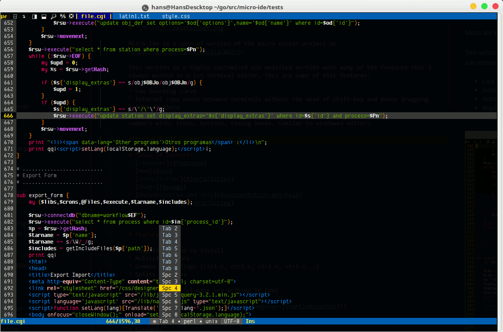

# 

Micro ide is a spin-off version of the great micro editor project at https://github.com/zyedidia/micro.

This version is a highly customized and modified versión with many of the features that I always wanted in a ssh terminal editor; and that are, some how, missing in all the editors I tried. Or some editors have all of them, but the learning curve to be proficient, has always been to steep for me (which is the first feature that I always wanted : _short learning curve_).

This version is also targeted to work on Linux servers. It does compile and may run under other platforms, but not all features will work. I'm mainly focused on **improving the experience of coding remotely over ssh on headless Linux servers**.

Many of those features were already provided by [micro editor](https://github.com/zyedidia/micro) :+1:. But some others were still missing :star:, and there inclusion are personal and not necessarily useful to everyone. This is the list of the most important features to me:

* :+1: Short learning curve
* :+1: Great syntax highlighting and easily customizable
* :star: Good cursor positioning after paste, cuts, duplicate a line, searching, moving on the edges of the window. So I have a clear view of the surrounding code.
* :star: Multiple language support
* :star: Auto detect file encoding. Open (decode) / Save (encode) in the original encoding of the file: UTF8, ISO8859, WINDOWS, etc. (Limited to the encoders available in go libraries)
* :star: Replace the need to learn too many key combinations and commands by the use (and abuse) of good mouse support with: icons, buttons, dialog boxes. Similar to windowed editors.
* :star: Use and abuse color to easily find the cursor, selected text, etc.
* :+1::star: Good and powerful plugin system to hack the editor to my personal needs
    - Without the need to compile or setup a complicated environment
    - Resilient to editor new versions
    - Plugins that will enhance the user coding for each particular language
* :star: Save editor settings for
    - a particular language (c,php,python,perl,..)
    - a single file
    - or just for the current opened session
* :star: A powerful auto indent
* :star: Auto complete
* :star: Internal copy paste between terminals in the same server without the need of _**shift-key and mouse dragging**_
* :star: Features that require a server to work
    - Internal copy paste between terminals in different servers without the need of _**shift-key and mouse dragging**_
    - Package **my** current editor, settings, plugins and hacks. To install on new servers
    - Package and retrieve **my** personal settings to quickly sync my editor's choices and hacks across different servers I work on, when the editor is already installed
    - Transfer a single script, text file quickly from one server to another
    - See [Support the project & Services](#support-the-project) for these features




# Table of Contents
- [Installation](#installation)
- [Usage](#usage)
- [Documentation and Help](#documentation-and-help)
- [Plugin Development](#plugin)
- [Contributing](#contributing)
    - [Translate](#translage)
- [Support the project & Services](#support-the-project)

- - -

# Installation

* Download a [prebuilt binary](https://github.com/hanspr/micro-ide/releases).
    - Place the binary in any location on your home directory
    - Crate an alias to the location of your executable
    - Execute micro-ide.
        - Note, the first time you run the editor will download the configurations from github
* You can build it from source, by cloning this repo and install all dependencies.

### Colors and syntax highlighting

If your terminal does not support 256 color. Try changing the colorscheme to `default16`, by going to Menu > System Settings : Select "cholorscheme".

If your terminal supports 256 colors but you do not see the full colors available you may try these commands:

```
export TERM=xterm-256color

#Add this line to your .bashrc
export TERM=xterm-256color
```

# Usage

Once you have built/installed the editor, start it by running `micro-ide path/to/file.txt` or simply `micro-ide` to open an empty buffer.

You can move the cursor around with the arrow keys and mouse.

You can also use the mouse to manipulate the text. Simply clicking and dragging will select text. You can also double click to enable word selection, and triple click to enable line selection.

[For a full introduction you may watch this video]()

# Documentation and Help

Micro-ide has a built-in help system which you can access by pressing `Alt-?` or `Ctrl-E` and typing `help`.

# Plugin

The plugin system has been modified in this version, you should be able to run any plugin you develop for micro editor, by doing some minor adjustments.

Please visit the [developers page](https://github.com/hanspr/micro-ide/wiki) with full instructions and videos about the plugin framework

# Contributing

You can use the [GitHub issue tracker](https://github.com/hanspr/micro-ide/issues) to report bugs, ask questions, or suggest new features.

To create pull requests, please follow these recommendations:

* Document very well your modifications in the code, so I can understand the changes
* Test your changes for a few weeks (by using the editor on real work). To confirm that your modification does not create a side effects on the rest of the editor. I tell this out of personal experience.
    - At the beginning I used to change one line of code and thought that I had fixed or improved something. A few days later I realized I broke something else.

## Translate

You may find the translation file in your config directory under : langs

- Open the file : en_US.lang
- Change the name to your ISO code location and translate each sentence after the | (pipe)
- Save the final file with the new name.
- Switch language by going to the menu > Global Settings
- Change to your new language
- If you want to contribute your translation
    - Clone : https://github.com/hanspr/mi-sources
    - Copy your file or update the current translation in the langs directory
    - Create a pull request

For more detailed instructions on how to translate micro-ide visit the [Wiki pages](https://github.com/hanspr/micro-ide/wiki)

# Support the project

If you find this project useful and want to support it, please use the following page to process your contribution.

This page will allow you to receive a key that you can use as a perpetual access to additional features of the editor that require cloud support to work, like:

* Internal copy paste between editors running in different servers
* File transfer between editors in different servers
* Save and retrieve your settings from any server. To sync all your micro-ide editors runngin in different machines
* Create your own full packed micro-ide with all your personal settings, plugins, hacks. So you may download and deploy on other servers without having to reconfigure and reinstall everything
