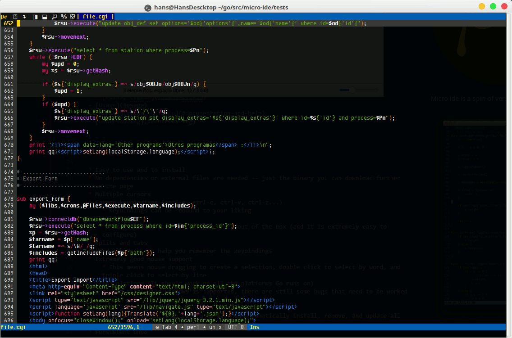

# 

mi-ide (_**mee ide**_ in spanish, _**my ide**_ in English. As in: this is _**my** editor_) is a spin-off version of micro editor project at https://github.com/zyedidia/micro.

This project is mainly focused on **improving the experience of coding remotely over ssh on headless Linux servers** (no X Server support, no Graphical interface, no menu luncher, desktop icons), simple plain bash.

Many of features were already provided by micro editor :+1:. But some others were still missing :star:, and there inclusion are not necessarily important to everyone.

This is the list of the most important existing features :

* :+1: Short learning curve
* :+1: Great syntax highlighting and easily customizable
* :star: Good cursor positioning after paste, cuts, duplicate a line, searching, moving on the edges of the window. So you always have a clear view of the surrounding code
* :star: Translate to other languages easily
* :star: Auto detect file encoding. Open (decode) / Save (encode) in the original encoding of the file: UTF8, ISO8859, WINDOWS, etc. (Limited to the encoders available in go libraries)
* :star: Replace the need to learn too many key combinations and commands by the use (and abuse) of good mouse support with: icons, buttons, dialog boxes. Similar to windowed editors
* :star: Use and abuse color to easily find the cursor, selected text, etc.
* :+1::star: Good and powerful plugin system to hack the editor to your personal needs.
    - Without the need to compile or setup a complicated environment
    - Resilient to editor new versions, so a plugin can last a long time without being recoded, and recoded.
    - Plugins that will enhance the user coding experience for each particular language
    - So you can say at the end of all your hacking: "finally!, I got **my** ide"
* :star: Save editor settings for
    - a particular coding language (c, php, python, perl,..)
    - a single file
    - or just for the current opened session
* :star: A powerful auto indent
* :star: Internal copy paste between terminals in the same server without the need of _**shift-key and mouse dragging**_
* :star: Features that require a server to work
    - Internal copy paste between terminals in different servers without the need of _**shift-key and mouse dragging**_
    - Package and retrieve your personal settings to quickly sync your editor's choices and hacks across different servers you work on, when the editor is already installed
    - Transfer a single script, text file quickly from one server to another
    - See [Support the project & Services](#support-the-project--services) for these features



# Table of Contents
- [Installation](#installation)
- [Usage](#usage)
- [Documentation and Help](#documentation-and-help)
- [Plugin Development](#plugin)
- [Contributing](#contributing)
    - [Translate](#translage)
- [Support the project & Services](#support-the-project)

- - -

# Installation

* Download a [prebuilt binary](https://github.com/hanspr/mi-ide/releases).
    - Unzip the release
        - `unzip release##.zip`
    - Place the binary in any location on your home directory, for example
        - `mv mi-ide ~/.local`
    - Create an alias in your `.bashrc` or `.bash_aliases` to the location of your executable
        - Change to your home directory : `cd`
        - Edit : `nano .bashrc` or `nano .bash_aliases`
        - add : `alias mi-ide='~/.local/mi-ide'`
        - reload changes: `. .bashrc` or `. .bash_aliases`
    - Execute mi-ide.
        - The first time you run the editor will download the configurations from github.
        - And place them in `~/.config/mi-ide/`

>**Important note**
>
>For convenience to everyone, included in the download is a compiled version of this piece of software: uchardet ( https://www.freedesktop.org/wiki/Software/uchardet/ ). It is compiled for 64 bits (no 32 bit version distributed).
>
>uchardet is not installed in all distributions by default, and some distributions have a very old one. And there is no port for it in pure "go" yet.
>
>This compiled binary is used as an external application, to detect the encoding of the file about to be opened, and then set the correct decoder and read the file into the editor.
>
>If you don't like this convenience (downloading a binary file) this is the alternative:
>
>1. `wget https://raw.githubusercontent.com/hanspr/mi-channel/master/config.zip`
>    1. Extract the directory
>    2. Remove `mi-ide/libs/uchardet`, `mi-ide/libs/libuchardet.so.0`
>    3. Copy the config directory to your .config directory
>2. After removing the binaries, if you still want uchardet support into mi-ide:
>    1. install uchardet for your distribution on your server (make sure that is version : 0.0.6 or above)
>    2. Or, download and compile your own version from https://www.freedesktop.org/wiki/Software/uchardet/ and install the compiled files on ~./config/mi-ide/libs or globally in your server

* You can also build mi-ide from source, by cloning this repo and install all dependencies.

```bash
go get "github.com/blang/semver"
go get "github.com/dustin/go-humanize"
go get "github.com/flynn/json5"
go get "github.com/go-errors/errors"
go get "github.com/hanspr/clipboard"
go get "github.com/hanspr/glob"
go get "github.com/hanspr/highlight"
go get "github.com/hanspr/ioencoder"
go get "github.com/hanspr/lang"
go get "github.com/hanspr/shellwords"
go get "github.com/hanspr/tcell"
go get "github.com/hanspr/terminal"
go get "github.com/hanspr/terminfo"
go get "github.com/mattn/go-isatty"
go get "github.com/mattn/go-runewidth"
go get "github.com/mitchellh/go-homedir"
go get "github.com/phayes/permbits"
go get "github.com/sergi/go-diff/diffmatchpatch"
go get "github.com/yuin/gopher-lua"
```

### Colors and syntax highlighting

If your terminal does not support 256 color. Try changing the colorscheme to `default16`, by going to Menu > System Settings : Select "colorscheme".

If your terminal supports 256 colors but you do not see the full colors available you may try these commands:

```
export TERM=xterm-256color

#Add this line to your .bashrc
export TERM=xterm-256color
```

# Usage

Once you have built/installed the editor, start it by running `mi-ide path/to/file.txt` or simply `mi-ide` to open an empty buffer.

The very first time will open a welcome.md file to give you the basic information about key bindings and how to access the help documentation.

You can move the cursor around with the arrow keys and mouse.

You can also use the mouse to select text, double click to enable a word, and triple click to enable line selection.

[For a full introduction you may watch this video](https://youtu.be/grHzfIvC6_I) (22 minutes)

# Documentation and Help

Mi-ide has a built-in help system which you can access by pressing `Alt-?` or `Ctrl-E` and typing `help`.

You will also find more detailed information on the [Wiki pages](https://github.com/hanspr/mi-ide/wiki)

# Plugin

The plugin system has been modified in this project, you should be able to run any plugin you develop for micro editor, by doing some minor adjustments.

Please visit the [developers page](https://github.com/hanspr/mi-sources/wiki/plugins) with full instructions and videos about the plugin framework

# Contributing

>**The only thing missing is a go library Client for the LSP protocol. If you  have the skills to help me implement one, please contact me opening an issue request.** [LSP Specifications](https://microsoft.github.io/language-server-protocol/specifications/specification-3-14/)

You can use the [GitHub issue tracker](https://github.com/hanspr/mi-ide/issues) to report bugs, ask questions, or suggest new features.

To create pull requests, please follow these recommendations:

* Document very well your modifications in the code, so I can understand the changes
* Test your changes for a few weeks (by using the editor on real work). To confirm that your modification does not create a side effects on the rest of the editor. I tell this out of personal experience.
    - At the beginning I used to change one line of code and thought that I had fixed or improved something. A few days later I realized I broke something else.

## Translate

You will find the translation file in your config directory under : langs

- Open the file : en_US.lang
- Change the name to your ISO code location
- Translate each sentence after the | (pipe)
- Save the final file with the new name.
- Switch language by going to the menu > Global Settings
- Change to your new language
- If you want to contribute your translation
    - Clone : https://github.com/hanspr/mi-sources
    - Copy your file or update the current translation in the langs directory
    - Create a pull request

[For more detailed information](https://github.com/hanspr/mi-sources/wiki/translate)

# Support the project & Services

If you find this project useful and decide to support it, you will receive in exchange a lifetime Cloud Key to activate Cloud Services.

|Kind       | Amount | Button |
|----------|--------:|--------|
|Just Support, not interested in a Cloud Key | 5 USD | [](https://www.paypal.com/cgi-bin/webscr?cmd=_s-xclick&hosted_button_id=YDQ2HBASRXTCE)|
|Support & Cloud Key | 20 USD | [](https://www.paypal.com/cgi-bin/webscr?cmd=_s-xclick&hosted_button_id=K43LR98FUSSNG)|
|Cloud Key & More Support | 50 USD | [](https://www.paypal.com/cgi-bin/webscr?cmd=_s-xclick&hosted_button_id=SAPEG25ZKA67N)|
|**Please wait after de payment to be redirected and receive your key** ||||


**A Cloud Key, gives you lifetime access to**

- **Internal Copy Paste between your editors running in different servers**, no more : shift click dragging
    - Avoid the problem of copying extra characters, numbers from the ruler
    - Copying partial text on very long lines. Or having to split them with new lines to be able to copy the hole line in one select.
    - Multiple selects if the area to copy is across many rows
    - Rebuild and reformat everything on the destination
- **Transfer any code file** that is opened in the current Window to different server running mi-ide
    - If you need a quick way to transfer code from one point to another just click to upload, click on the other server to download.
- **Save and retrieve your settings** from any server. To sync all your : settings, plugins, hacks, colors, bindings, etc.
- All your information is **completely confidential and secure**.
    - Check the code at : ["github.com/hanspr/clipboard"](github.com/hanspr/clipboard)
    - It is very easy to read and follow
- **How does it work?**
    - All connections are over https
    - You set up 3 values in the editor
        - The key assigned to you
        - A password that you select
        - A passphrase that you select
    - The key and password gives you access to your clipboard, settings, and files.
        - The key and password are transmitted to the server on every transaction to validate the access to your account
    - The passphrase:
        - Is never sent to the server
    - On Copy, Upload File or Settings
        - mi-ide encrypts your clip, file or settings using your passphrase
        - The application, sends your key and password only
        - Transfers the data to the server
        - The server stores your encrypted : clipboard, file or settings
    - On Paste, File Download or Settings
        - The application, sends your key and password only
        - It receives the data : clipboard, file or settings
        - Decrypts the data using your passphrase
            - Inserts the clipboard in your current buffer, or
            - Opens the file in a new tab, or
            - Installs your settings
- **Any new features that could come in the future**
-  **Request** to implement new ideas based on this Cloud model that could be beneficial for every one.
- **Limitations**
  - The service requires the Internet to provide this functionality
    - If a firewall in your network blocks: access to the Internet, port 443 or the subdomain api.mi-ide.com, the functionality will be lost.
  - Keys are not shareable, no hard checks implemented now, hope never have to.
  - Lifetime access is a huge compromise, it is on my will to do so, please use the service responsibly: No robots, do not use for other purposes than the helping your self coding.
  - If any abuse is detected the service for that **key** will be suspended
  - If you have a business and you want to have the server in your internal network, or personal server [contact me](https://github.com/hanspr).
